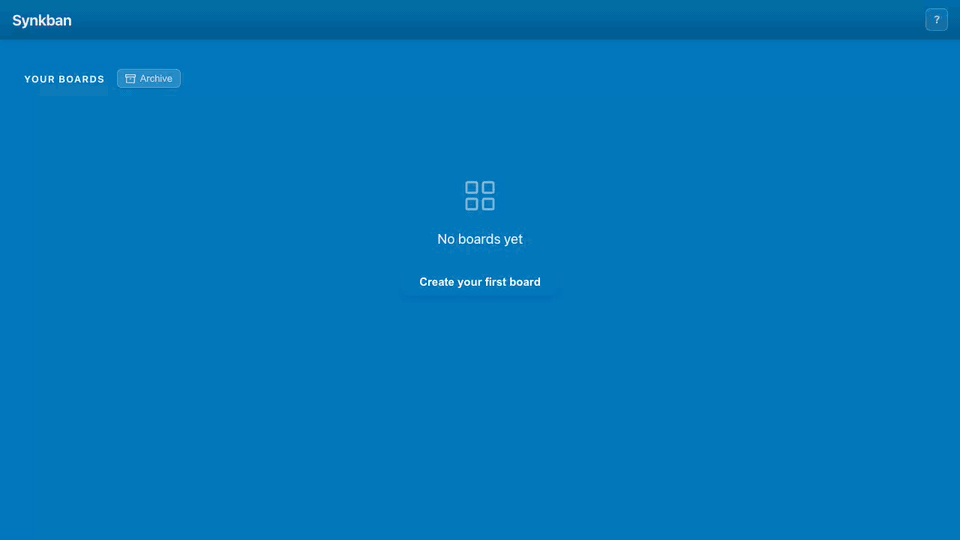

# Synkban

A **local-first, keyboard-driven, syncable** (via any third party file sync) kanban board with a Rust backend (Actix Web) and SolidJS frontend. Data stored as JSON files on disk.



Can be run in two ways:

* Standalone Electron app
* Web Server for deployment behind an authenticating proxy

## Features

- **Boards** — create, rename, recolor, archive/restore, reorder
- **Lists** — add to boards, reorder via drag-and-drop or keyboard, delete (archives any cards)
- **Cards** — drag within/across lists, archive/restore, permanent delete
- **Card detail** — modal with title (markdown bold/italic), rich text description (ProseMirror), labels, due date, file attachments (≤50 MB) with image thumbnails + preview
- **Labels** — per-board colored tags; auto-assigned palette; filter cards by label
- **Filter** — search cards by text + label inside a board
- **Archive** — soft-delete for boards and cards (separate undo flows)
- **Keyboard-first** — full keyboard navigation; press `?` for in-app help
- **Drag-and-drop** — HTML5 native drag API, fractional indexing for position (no bulk reorder updates)
- **File-based storage** — nested JSON files, no database required
- **Single binary** — frontend assets embedded at compile time via `include_dir`
- **Desktop mode** — optional Electron wrapper that bundles the binary + a native window (`./build.sh --desktop`)

## Prerequisites

| Tool                              | Version | Purpose                                |
| --------------------------------- | ------- | -------------------------------------- |
| [Rust](https://rustup.rs/)        | 1.70+   | Backend compilation                    |
| [Node.js](https://nodejs.org/)    | 18+     | Frontend build                         |
| [Docker](https://www.docker.com/) | any     | Optional, for containerized deployment |

## Quick Start

```bash
# Build everything into a single binary
./build.sh

# Run (creates ./data/ directory automatically)
./backend/target/release/synkban

# Open http://localhost:8080
```

## Development

Dev setup, API reference, project structure, architecture notes, and testing are documented separately:

➡️ **[Development guide](docs/development.md)**

## Build

```bash
./build.sh
```

This script:

1. Builds the frontend (`pnpm install && pnpm run build` → `frontend/dist/`)
2. Copies `frontend/dist/` → `backend/static/`
3. Compiles the backend in release mode, embedding static files into the binary

Output: `backend/target/release/synkban` — a single binary you can copy anywhere and run.

## Configuration

All configuration via environment variables:

| Variable   | Default     | Description                                    |
| ---------- | ----------- | ---------------------------------------------- |
| `HOST`     | `127.0.0.1` | Bind address                                   |
| `PORT`     | `8080`      | Bind port                                      |
| `DATA_DIR` | `./data`    | Path to data directory (created automatically) |

Example:

```bash
HOST=0.0.0.0 PORT=3000 DATA_DIR=/var/lib/tc ./synkban
```

## Docker

### Build

```bash
./docker-build.sh            # defaults to synkban:latest
./docker-build.sh myapp 1.0  # custom name:tag
# or directly:
docker build -t synkban .
```

### Run

```bash
# Ephemeral
docker run -p 8080:8080 synkban

# Persistent data
docker run -p 8080:8080 -v synkban-data:/app/data synkban
```

The Dockerfile is a multi-stage build:

1. **node:22** — builds frontend
2. **rust:1.95** — copies frontend dist into `static/`, compiles backend with embedded assets
3. **debian:bookworm-slim** — minimal runtime image with just the binary

## Self-Hosting (Docker Compose + authenticating proxy)

Synkban's web server has **no authentication of its own** (single-user MVP), so run it behind an authenticating reverse proxy on an internal network with no published ports. Full step-by-step setup with Docker Compose + Caddy (login form + long-lived session cookie via the `caddy-security` plugin):

➡️ **[Self-hosting behind Caddy + caddy-security](docs/self-hosting-caddy-security.md)**

## Data Storage

Data is stored as JSON files in a nested directory structure under `DATA_DIR`:

```
data/
└── boards/
    └── {board-id}/
        ├── board.json
        ├── lists/
        │   └── {list-id}/
        │       ├── list.json
        │       └── cards/
        │           └── {card-id}.json
        ├── archived_cards/                # orphaned cards (their list was deleted)
        │   └── {card-id}.json
        └── attachments/
            └── {card-id}/
                ├── {att-id}                # raw bytes (no extension)
                └── {att-id}_thumb          # JPEG, only for image attachments
```

Empty parent directories (`lists/`, `archived_cards/`, `attachments/`, etc.) are cleaned up automatically when their last child is removed.

### board.json

```json
{
  "id": "uuid",
  "title": "My Board",
  "created_at": "2026-05-13 14:08:21",
  "labels": [{ "id": "uuid", "name": "Bug", "color": "#ffb3b3" }],
  "color": "#0079bf",
  "archived": false,
  "position": 1.0
}
```

### list.json

```json
{
  "id": "uuid",
  "board_id": "uuid",
  "title": "To Do",
  "position": 1.0,
  "created_at": "2026-05-13 14:08:21"
}
```

### {card-id}.json

```json
{
  "id": "uuid",
  "list_id": "uuid",
  "title": "My Card",
  "description": "{\"type\":\"doc\",\"content\":[...]}",
  "position": 1.0,
  "created_at": "2026-05-13 14:08:21",
  "label_ids": ["uuid", "uuid"],
  "archived": false,
  "attachments": [
    { "id": "uuid", "filename": "spec.pdf", "size": 12345, "content_type": "application/pdf", "created_at": "2026-05-13 14:08:21" }
  ],
  "due_date": "2026-06-15"
}
```

The `description` field stores a ProseMirror document as a JSON string. Empty descriptions are stored as `""`. ProseMirror is safe by design — it uses a schema-constrained document model, not raw HTML.

### Backup / Migration

Data is plain JSON files. To back up: copy the `data/` directory. To migrate: move the directory to the new host and point `DATA_DIR` at it.

### Position field

Lists and cards use a `position: f64` field for ordering. New items get `max_position + 1.0`. Reordering sets position to the midpoint between neighbors (fractional indexing). This avoids bulk-updating all positions on every reorder.
