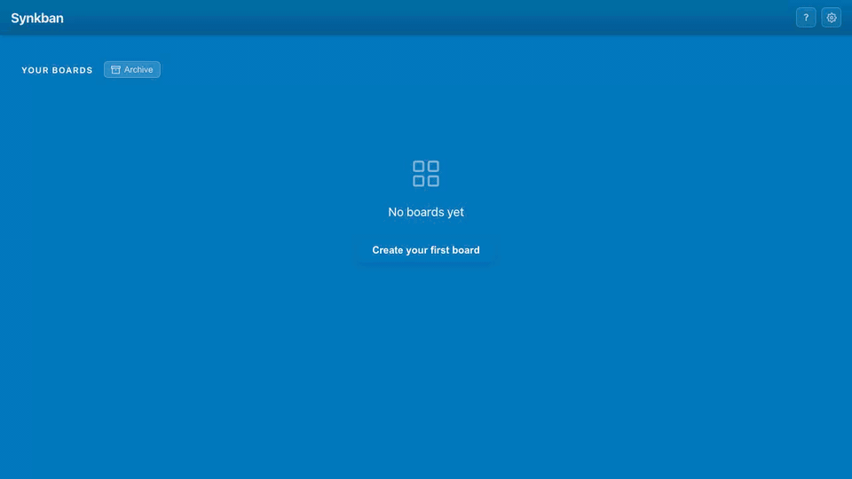

# Synkban

A **local-first, keyboard-driven, syncable** (via any third party file sync) kanban board with a Rust backend (Actix Web) and SolidJS frontend. Data stored as JSON files on disk.



Can be run in two ways:

* Standalone Electron app
* Web Server for deployment behind an authenticating proxy

## Features

- **Boards** — create, rename, recolor, archive/restore, reorder
- **Lists** — add to boards, reorder via drag-and-drop or keyboard, delete (archives any cards)
- **Cards** — drag within/across lists, archive/restore, permanent delete
- **Card detail** — modal with title (markdown bold/italic), rich text description (ProseMirror), labels, due date, checklist, file attachments (≤50 MB) with image thumbnails + preview
- **Labels** — per-board colored tags; auto-assigned palette; filter cards by label
- **Filter** — search cards by text + label inside a board
- **Archive** — soft-delete for boards and cards (separate undo flows)
- **Keyboard-first** — full keyboard navigation; press `?` for in-app help
- **Drag-and-drop** — HTML5 native drag API, fractional indexing for position (no bulk reorder updates)
- **File-based storage** — nested JSON files, no database required
- **Single binary** — frontend assets embedded at compile time via `include_dir`
- **Desktop mode** — optional Electron wrapper that bundles the binary + a native window (`./build.sh --desktop`)

## Quick Start

```bash
# Build everything into a single binary
./build.sh

# Run (creates ./data/ directory automatically)
./backend/target/release/synkban

# Open http://localhost:8080
```

## Development

Dev setup, API reference, project structure, architecture notes, and testing are documented separately:

➡️ **[Development guide](docs/development.md)**

## Configuration

Environment variables and CLI flags:

| Variable   | Default     | Description                                      |
| ---------- | ----------- | ------------------------------------------------ |
| `HOST`     | `127.0.0.1` | Bind address                                     |
| `PORT`     | `8080`      | Bind port                                        |
| `DATA_DIR` | `./data`    | **Path to the data directory** (created if absent) |

| Flag                | Description                                        |
| ------------------- | -------------------------------------------------- |
| `--data-dir <path>` | Data directory; takes precedence over `DATA_DIR`   |

```bash
HOST=0.0.0.0 PORT=3000 DATA_DIR=/var/lib/tc ./synkban
# or
./synkban --data-dir /var/lib/tc
```

### Config file

Persistent settings live in `~/.config/synkban/synkban.toml` (all platforms and modes; directory overridable via `SYNKBAN_CONFIG_DIR`):

```toml
data_dir = "/home/me/Sync/synkban"   # optional custom data directory
startup_view = "last"                 # "overview" (default) | "last"
last_board_id = "…"                   # maintained automatically
```

You normally never edit it — the in-app **⚙ Settings** dialog (gear button on the board overview) writes it for you.

### How the effective data directory is determined

The data directory is the one setting that decides **where all your boards live**. Resolution order (identical in web server and desktop mode):

1. `--data-dir` CLI flag
2. `DATA_DIR` environment variable
3. `data_dir` in `~/.config/synkban/synkban.toml`
4. default: `~/.config/synkban/data/`

Created automatically on first run. In the desktop app a custom folder (e.g. inside your Syncthing/Dropbox tree) can be chosen via **⚙ Settings** → *Data folder* → *Browse…*; saving restarts the app on the new folder. Existing boards are **not** moved automatically — copy the `boards/` folder yourself.

### Startup view

By default the app opens on the board overview. **⚙ Settings** → *On startup, open* switches to reopening the last used board instead (persisted in the config file; deep links always win, and a board that no longer exists falls back to the overview).

Data is plain JSON files: to back up, copy the directory; to migrate, move it to the new host and point `DATA_DIR` at it. The on-disk layout and file formats are documented in the [development guide](docs/development.md#data-storage).

## Docker

### Build

```bash
./docker-build.sh            # defaults to synkban:latest
./docker-build.sh myapp 1.0  # custom name:tag
# or directly:
docker build -t synkban .
```

### Run

```bash
# Ephemeral
docker run -p 8080:8080 synkban

# Persistent data
docker run -p 8080:8080 -v synkban-data:/app/data synkban
```

The Dockerfile is a multi-stage build:

1. **node:22** — builds frontend
2. **rust:1.95** — copies frontend dist into `static/`, compiles backend with embedded assets
3. **debian:bookworm-slim** — minimal runtime image with just the binary

## Self-Hosting (Docker Compose + authenticating proxy)

Synkban's web server has **no authentication of its own** (single-user MVP), so run it behind an authenticating reverse proxy on an internal network with no published ports. Full step-by-step setup with Docker Compose + Caddy (login form + long-lived session cookie via the `caddy-security` plugin):

➡️ **[Self-hosting behind Caddy + caddy-security](docs/self-hosting-caddy-security.md)**
